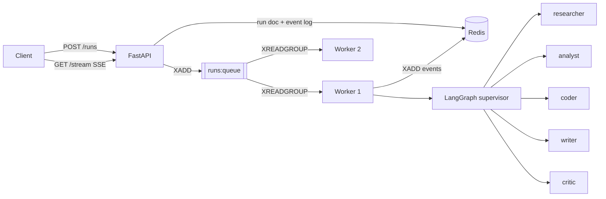

# AgentMesh

**A multi-agent orchestration service on LangGraph + FastAPI + Redis.**

AgentMesh is a small, readable reference implementation of the pattern you keep
re-implementing: a supervisor agent that routes an objective to specialist
agents, a durable event log you can stream over SSE, and a worker fleet you can
scale horizontally.

It runs end to end with **no API key and no network** - a deterministic mock
model ships in the box - and switches to OpenAI, Anthropic or Ollama with one
environment variable.

[](https://github.com/gen71718-dev/AgentMesh/actions/workflows/ci.yml)
[](https://www.python.org/)
[](LICENSE)

[中文说明](README.zh-CN.md)

---

## Why this exists

Most multi-agent demos are a single script. Turning one into a service means
answering questions the demo skips: where does run state live, how does a client
follow progress, what happens when a worker dies mid-run, how do you add an
agent without touching the orchestration, and how do you test any of it without
burning tokens?

AgentMesh is those answers, in a couple of thousand lines you can read in an
afternoon.

## Features

- **Supervisor graph** - a LangGraph `StateGraph` where a supervisor routes to
  specialists that always hand control back. Add an agent by registering a
  definition; the topology does not change.
- **Five built-in specialists** - `researcher`, `analyst`, `coder`, `writer`,
  `critic`, each with its own tools, prompt and report contract.
- **Five built-in tools** - `web_search` (Tavily), `knowledge_search` (local
  files), `calculator`, `python_repl` (sandboxed, opt-in), `current_time` - plus
  a registry for your own.
- **Provider agnostic** - OpenAI, Anthropic, Ollama or a deterministic `mock`
  model. No vendor SDK leaks into the orchestration code.
- **Redis, used properly** - a stream as the work queue with a consumer group and
  `XAUTOCLAIM` recovery, a stream per run as a replayable event log, `INCR`
  sequence counters, TTL'd run documents, and an optional Redis checkpointer for
  LangGraph (needs Redis Stack, see below).
- **Zero-dependency mode** - `AGENTMESH_STATE_BACKEND=memory` swaps Redis for an
  in-process implementation of the same interface, so tests and local dev need
  nothing but Python.
- **Two ways to execute** - `inline` (the API process runs the graph) or `queue`
  (a separate worker fleet consumes the queue).
- **Live progress** - Server-Sent Events with `Last-Event-ID` resume, so a
  dropped connection replays instead of losing events.
- **Boringly operable** - `/healthz`, `/readyz`, `/metrics`, JSON logs, request
  ids, a non-root container, graceful shutdown, and `agentmesh doctor`.
- **Offline test suite** - the whole HTTP surface is exercised against the mock
  model: no keys, no network, no Redis.

## Quickstart

### Docker (the whole stack)

```bash
git clone https://github.com/gen71718-dev/AgentMesh.git
cd agentmesh
cp .env.example .env          # optional; sensible defaults are built in
docker compose up -d --build
```

That starts Redis, the API on <http://localhost:8100>, and two workers.

```bash
curl -s localhost:8100/api/v1/runs \
  -H 'content-type: application/json' \
  -d '{"task":"Explain Redis consumer groups to a new backend engineer"}'
```

Follow it live:

```bash
curl -N localhost:8100/api/v1/runs/<run_id>/stream
```

Interactive API docs: <http://localhost:8100/docs>.

The API listens on `8100` by default, so it can sit next to the many tools
that already claim `8000`. If `8100` is taken as well, override it: set
`AGENTMESH_PORT=9000` in `.env`, or run `agentmesh serve --port 9000`.

### Locally, without Docker

```bash
uv sync --extra dev                 # or: pip install -e ".[dev]"
uv run agentmesh serve --reload     # http://localhost:8100
uv run agentmesh run "Explain Redis consumer groups" --watch
```

No Redis and no API key are required: the default configuration is
`state_backend=memory`, `llm_provider=mock`.

### With a real model

```bash
export AGENTMESH_LLM_PROVIDER=openai
export AGENTMESH_LLM_MODEL=gpt-4o-mini
export AGENTMESH_OPENAI_API_KEY=sk-...
uv run agentmesh serve
```

Or a local model, entirely offline:

```bash
docker compose --profile ollama up -d
docker compose exec ollama ollama pull llama3.2
export AGENTMESH_LLM_PROVIDER=ollama
export AGENTMESH_LLM_MODEL=llama3.2
```

## How it works



The graph itself is deliberately small:

```
START -> supervisor -> {specialist, specialist, ...} -> supervisor -> END
```

The supervisor sees the objective, the candidate specialists and every report so
far, and answers with exactly one line (`NEXT: <agent>` or `NEXT: FINISH`). A new
specialist is a new node plus one more candidate - nothing else changes.

`agentmesh/graph/routing.py` parses that decision defensively (JSON, `NEXT:`
labels, prose mentions, with a fail-safe stop), because a routing mis-parse is
silent and expensive.

See [docs/ARCHITECTURE.md](docs/ARCHITECTURE.md) for the data model, the Redis
key layout and the run state machine.
## API

| Method | Path | Purpose |
| --- | --- | --- |
| `POST` | `/api/v1/runs` | Submit a task; returns `202` with a `run_id` |
| `GET` | `/api/v1/runs` | List recent runs (`?status=&limit=`) |
| `GET` | `/api/v1/runs/{id}` | Full run record |
| `GET` | `/api/v1/runs/{id}/result` | Just the answer |
| `GET` | `/api/v1/runs/{id}/events` | Event log as JSON (`?after=<event id>`) |
| `GET` | `/api/v1/runs/{id}/stream` | Event log as SSE (resumable) |
| `POST` | `/api/v1/runs/{id}/cancel` | Cancel a queued or running run |
| `GET` | `/api/v1/agents`, `/api/v1/agents/{name}` | Agent catalog |
| `GET` | `/api/v1/tools` | Tool catalog with availability |
| `GET` | `/healthz`, `/readyz`, `/metrics` | Ops probes and metrics |

```bash
curl -s localhost:8100/api/v1/runs \
  -H 'content-type: application/json' \
  -d '{"task":"Compare Redis Streams and Kafka for a five-person team","agents":["researcher","analyst","writer"],"max_steps":6}'
```

```json
{"run_id":"run_1f0c9d2a...","thread_id":"thread_9ab21c...","status":"queued","created_at":"2026-01-01T00:00:00Z"}
```

Event types: `run.queued`, `run.started`, `supervisor.route`, `agent.started`,
`tool.started`, `tool.finished`, `agent.finished`, `run.completed`, `run.failed`,
`run.cancelled`, `log`.

### Streaming from Python

```python
import httpx

with httpx.stream("GET", f"http://localhost:8100/api/v1/runs/{run_id}/stream") as stream:
    for line in stream.iter_lines():
        if line.startswith("data: "):
            print(line[6:])
```

## Configuration

Every setting is an `AGENTMESH_*` environment variable; [`.env.example`](.env.example)
lists them all with commentary. The ones that change how the system behaves:

| Variable | Default | Meaning |
| --- | --- | --- |
| `AGENTMESH_LLM_PROVIDER` | `mock` | `mock`, `openai`, `anthropic` or `ollama` |
| `AGENTMESH_LLM_MODEL` | `gpt-4o-mini` | Model name for the chosen provider |
| `AGENTMESH_STATE_BACKEND` | `memory` | `memory` or `redis` |
| `AGENTMESH_CHECKPOINT_BACKEND` | `memory` | `memory` or `redis` (redis needs a Redis Stack server) |
| `AGENTMESH_EXECUTION_MODE` | `inline` | `inline` or `queue` (queue needs redis) |
| `AGENTMESH_WORKER_CONCURRENCY` | `4` | Concurrent runs per worker process |
| `AGENTMESH_MAX_SUPERVISOR_STEPS` | `8` | Hard ceiling on routing decisions per run |
| `AGENTMESH_MAX_TOOL_ITERATIONS` | `3` | Tool round-trips per agent turn |
| `AGENTMESH_DEFAULT_AGENTS` | `researcher,analyst,writer` | Team used when a request omits `agents` |
| `AGENTMESH_ENABLE_PYTHON_TOOL` | `false` | Allow model-authored Python (see Security) |
| `AGENTMESH_KNOWLEDGE_DIR` | unset | Folder searched by `knowledge_search` |
| `AGENTMESH_TAVILY_API_KEY` | unset | Enables live `web_search` |
| `AGENTMESH_REDIS_URL` | `redis://localhost:6379/0` | Redis connection string |

`agentmesh doctor` prints the effective configuration, tool availability and
backend connectivity, and flags inconsistent combinations.

## CLI

```bash
agentmesh serve [--reload] [--host H] [--port P]   # the API
agentmesh worker [--once]                          # a queue consumer
agentmesh run "task" [--watch] [--agents a,b]      # submit and follow
agentmesh agents                                   # list the team
agentmesh tools                                    # list the tools
agentmesh doctor                                   # check the environment
```
## Extending it

### Add a tool

```python
# src/agentmesh/tools/weather.py
from langchain_core.tools import tool

from agentmesh.tools.registry import ToolSpec, register


@tool("get_weather")
def get_weather(city: str) -> str:
    """Return the current weather for a city."""
    return f"{city}: 21C, clear"


register(
    ToolSpec(
        name="get_weather",
        description=get_weather.description,
        factory=lambda: get_weather,
        tags=("weather", "network"),
    )
)
```

Import it in `src/agentmesh/tools/__init__.py` (that is what registers it), then
add `"get_weather"` to an agent's `tools` list.

### Add an agent

```python
# src/agentmesh/agents/builtin.py
SECURITY = AgentDefinition(
    name="security",
    title="Security Reviewer",
    description="Threat-models designs and reviews code for exploitable flaws.",
    system_prompt=_prompt("Security Reviewer", "Find exploitable flaws, ranked by severity."),
    tools=["knowledge_search", "web_search"],
    order=60,
)

BUILTIN_AGENTS = (RESEARCHER, ANALYST, CODER, WRITER, CRITIC, SECURITY)
```

Request it with `"agents": ["researcher", "security", "writer"]`. The supervisor
discovers the new candidate automatically - no graph changes.

### Add a provider

Add one branch to `_build()` in `src/agentmesh/llm/factory.py`. Anything that
subclasses `BaseChatModel` works, including a model you wrote yourself.

Working examples live in [examples/](examples/).

## Testing

```bash
uv run pytest                 # offline, no keys, no Redis
uv run pytest --cov=agentmesh
uv run ruff check src tests
uv run mypy
```

The suite drives the real HTTP surface against the mock model and the in-memory
store, so it covers the graph, the routing parser, the event log, SSE and the API
without touching the network. Everything runs on the same interfaces your
production configuration uses - only the backends differ.

## Security notes

- `python_repl` executes model-authored code. It is **off by default**, runs with
  a restricted `__builtins__`, no imports, and truncated output - but that is a
  guardrail, not a security boundary. Enable it only inside a sandboxed runtime.
- `knowledge_search` reads files under `AGENTMESH_KNOWLEDGE_DIR`. Point it at a
  directory containing nothing you would not paste into a prompt.
- The API ships **without authentication**. Put it behind your gateway, or add a
  dependency in `src/agentmesh/api/deps.py` - every route already depends on one.
- `web_search` sends queries to Tavily, and retrieved text is untrusted input.

## Project layout

```
src/agentmesh/
  api/            FastAPI app: deps, routes (runs, agents, health)
  agents/         agent definitions, registry, runtime (the tool loop)
  graph/          LangGraph state, supervisor builder, routing, checkpointer
  tools/          tool registry and built-ins
  storage/        RunStore interface + memory and redis backends
  events/         the event bus every node publishes through
  worker/         graph registry, run executor, queue consumer
  llm/            provider factory + the offline mock model
  config.py       typed settings
  cli.py          the agentmesh command
tests/            offline test suite
docs/             architecture notes and the sample knowledge base
examples/         runnable examples
```

## Roadmap

- [ ] Human-in-the-loop interrupts for approval gates
- [ ] A Postgres checkpointer alongside the Redis one
- [ ] Per-run token and cost accounting in the event log
- [ ] OpenTelemetry spans across API -> worker -> graph -> tool
- [ ] A minimal web UI over the event stream

## Contributing

Issues and pull requests are welcome - see [CONTRIBUTING.md](CONTRIBUTING.md).
`make help` lists the available tasks.

## License

MIT - see [LICENSE](LICENSE).
