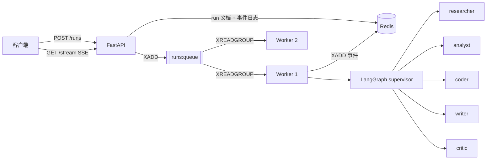

# AgentMesh

**基于 LangGraph + FastAPI + Redis 的多智能体编排服务。**

[English](README.md) | 简体中文

AgentMesh 是那种"你总在重复实现"的架构的一份小而可读的参考实现：一个
supervisor（调度者）智能体把目标分派给若干专家智能体，一份可回放的事件日志可以通过
SSE 实时推送，一组可以横向扩容的 worker 进程。

它**不需要任何 API Key、也不需要联网**就能完整跑起来（内置一个确定性的 mock 模型），
只需要改一个环境变量就能切换到 OpenAI / Anthropic / Ollama。

## 为什么会有这个项目

绝大多数多智能体演示都是一个脚本。而把它变成一个真正的服务，需要回答演示里被跳过的
问题：运行状态放在哪？客户端怎么跟踪进度？worker 中途挂了怎么办？新增一个 agent 要
不要改编排代码？以及——怎么在不烧 token 的前提下测试这一切？

AgentMesh 就是这些问题的答案。

## 特性

- **Supervisor 图**：LangGraph `StateGraph`，supervisor 把任务路由给专家，专家执行完
  一定把控制权交回。新增 agent 只需要注册一个定义，拓扑结构不变。
- **五个内置专家**：`researcher`（调研）、`analyst`（量化分析）、`coder`（工程）、
  `writer`（写作）、`critic`（红队评审），各自有工具、提示词和报告格式约定。
- **五个内置工具**：`web_search`（Tavily）、`knowledge_search`（本地文档检索）、
  `calculator`、`python_repl`（受限沙箱，默认关闭）、`current_time`，并提供工具注册表。
- **模型可插拔**：OpenAI / Anthropic / Ollama / 确定性 mock，编排代码里没有任何厂商 SDK。
- **正经用 Redis**：用 Stream + 消费者组做任务队列并支持 `XAUTOCLAIM` 故障回收；每个 run
  一条 Stream 作为可回放的事件日志；`INCR` 做事件序号；run 文档带 TTL；并可选接入
  LangGraph 的 Redis checkpointer。
- **零依赖模式**：`AGENTMESH_STATE_BACKEND=memory` 用同一套接口的内存实现替换 Redis，
  本地开发和测试除 Python 外什么都不需要。
- **两种执行模式**：`inline`（API 进程内直接跑图）或 `queue`（独立 worker 集群消费队列）。
- **实时进度**：SSE 推送，支持 `Last-Event-ID` 断线续传——断连是重放而不是丢事件。
- **可运维**：`/healthz`、`/readyz`、`/metrics`、JSON 日志、request id、非 root 容器、
  优雅退出，以及 `agentmesh doctor` 自检命令。
- **可离线测试**：整个 HTTP 层都用 mock 模型跑通，不需要 Key、不需要网络、不需要 Redis。

## 快速开始

### Docker（一键起全栈）

```bash
git clone https://github.com/gen71718-dev/AgentMesh.git
cd agentmesh
cp .env.example .env          # 可选，默认值开箱可用
docker compose up -d --build
```

会启动 Redis、API（<http://localhost:8000>）和两个 worker。

```bash
curl -s localhost:8000/api/v1/runs \
  -H 'content-type: application/json' \
  -d '{"task":"给一个新入职的后端工程师讲清楚 Redis 消费者组"}'
```

实时跟踪：

```bash
curl -N localhost:8000/api/v1/runs/<run_id>/stream
```

在线 API 文档：<http://localhost:8000/docs>。

### 本地运行（不用 Docker）

```bash
uv sync --extra dev                 # 或者 pip install -e ".[dev]"
uv run agentmesh serve --reload     # http://localhost:8000
uv run agentmesh run "讲清楚 Redis 消费者组" --watch
```

默认配置就是 `state_backend=memory` + `llm_provider=mock`，所以不需要 Redis，也不需要 Key。

### 接入真实模型

```bash
export AGENTMESH_LLM_PROVIDER=openai
export AGENTMESH_LLM_MODEL=gpt-4o-mini
export AGENTMESH_OPENAI_API_KEY=sk-...
uv run agentmesh serve
```

或者用完全本地的模型：

```bash
docker compose --profile ollama up -d
docker compose exec ollama ollama pull llama3.2
export AGENTMESH_LLM_PROVIDER=ollama
export AGENTMESH_LLM_MODEL=llama3.2
```

## 工作原理



图本身刻意做得极小：

```
START -> supervisor -> {专家, 专家, ...} -> supervisor -> END
```

supervisor 每轮看到目标、候选专家和目前所有报告，然后只回一行：`NEXT: <agent>` 或
`NEXT: FINISH`。新增专家 = 新增一个节点 + 一个候选，其它都不用动。

`agentmesh/graph/routing.py` 对这条决策做了防御性解析（JSON、`NEXT:` 标签、自然语言
提及，最后失败即安全停止），因为路由解析错了是静默且昂贵的。

数据模型、Redis key 布局和 run 状态机见 [docs/ARCHITECTURE.md](docs/ARCHITECTURE.md)。
## API

| 方法 | 路径 | 说明 |
| --- | --- | --- |
| `POST` | `/api/v1/runs` | 提交任务，返回 `202` 和 `run_id` |
| `GET` | `/api/v1/runs` | 列出最近的 run（`?status=&limit=`） |
| `GET` | `/api/v1/runs/{id}` | 完整 run 记录 |
| `GET` | `/api/v1/runs/{id}/result` | 只取答案 |
| `GET` | `/api/v1/runs/{id}/events` | 事件日志（JSON，支持 `?after=`） |
| `GET` | `/api/v1/runs/{id}/stream` | 事件日志（SSE，可断线续传） |
| `POST` | `/api/v1/runs/{id}/cancel` | 取消排队中或运行中的 run |
| `GET` | `/api/v1/agents`、`/api/v1/agents/{name}` | 智能体目录 |
| `GET` | `/api/v1/tools` | 工具目录及可用性 |
| `GET` | `/healthz`、`/readyz`、`/metrics` | 运维探针与指标 |

```bash
curl -s localhost:8000/api/v1/runs \
  -H 'content-type: application/json' \
  -d '{"task":"对比 Redis Streams 和 Kafka 对五人团队的取舍","agents":["researcher","analyst","writer"],"max_steps":6}'
```

```json
{"run_id":"run_1f0c9d2a...","thread_id":"thread_9ab21c...","status":"queued","created_at":"2026-01-01T00:00:00Z"}
```

事件类型：`run.queued`、`run.started`、`supervisor.route`、`agent.started`、
`tool.started`、`tool.finished`、`agent.finished`、`run.completed`、`run.failed`、
`run.cancelled`、`log`。

## 配置

所有配置都是 `AGENTMESH_*` 环境变量，完整带注释的清单见 [`.env.example`](.env.example)。
最影响行为的几项：

| 变量 | 默认值 | 含义 |
| --- | --- | --- |
| `AGENTMESH_LLM_PROVIDER` | `mock` | `mock` / `openai` / `anthropic` / `ollama` |
| `AGENTMESH_LLM_MODEL` | `gpt-4o-mini` | 模型名 |
| `AGENTMESH_STATE_BACKEND` | `memory` | `memory` 或 `redis` |
| `AGENTMESH_CHECKPOINT_BACKEND` | `memory` | `memory` 或 `redis` |
| `AGENTMESH_EXECUTION_MODE` | `inline` | `inline` 或 `queue`（queue 需要 redis） |
| `AGENTMESH_WORKER_CONCURRENCY` | `4` | 每个 worker 进程的并发 run 数 |
| `AGENTMESH_MAX_SUPERVISOR_STEPS` | `8` | 单个 run 的路由次数上限 |
| `AGENTMESH_MAX_TOOL_ITERATIONS` | `3` | 单个 agent 回合的工具往返次数 |
| `AGENTMESH_DEFAULT_AGENTS` | `researcher,analyst,writer` | 请求未指定 `agents` 时使用的团队 |
| `AGENTMESH_ENABLE_PYTHON_TOOL` | `false` | 是否允许执行模型生成的 Python（见安全说明） |
| `AGENTMESH_KNOWLEDGE_DIR` | 未设置 | `knowledge_search` 检索的目录 |
| `AGENTMESH_TAVILY_API_KEY` | 未设置 | 开启真实 `web_search` |
| `AGENTMESH_REDIS_URL` | `redis://localhost:6379/0` | Redis 连接串 |

`agentmesh doctor` 会打印生效配置、工具可用性和后端连通性，并提示相互冲突的组合。

## 命令行

```bash
agentmesh serve [--reload] [--host H] [--port P]   # 启动 API
agentmesh worker [--once]                          # 启动队列消费者
agentmesh run "任务" [--watch] [--agents a,b]       # 提交并跟踪
agentmesh agents                                   # 列出智能体
agentmesh tools                                    # 列出工具
agentmesh doctor                                   # 环境自检
```

## 扩展

### 新增工具

```python
# src/agentmesh/tools/weather.py
from langchain_core.tools import tool

from agentmesh.tools.registry import ToolSpec, register


@tool("get_weather")
def get_weather(city: str) -> str:
    """Return the current weather for a city."""
    return f"{city}: 21C, clear"


register(
    ToolSpec(
        name="get_weather",
        description=get_weather.description,
        factory=lambda: get_weather,
        tags=("weather", "network"),
    )
)
```

在 `src/agentmesh/tools/__init__.py` 里 import 它（这就是注册动作），然后把
`"get_weather"` 加到某个 agent 的 `tools` 列表里。

### 新增专家

```python
# src/agentmesh/agents/builtin.py
SECURITY = AgentDefinition(
    name="security",
    title="Security Reviewer",
    description="Threat-models designs and reviews code for exploitable flaws.",
    system_prompt=_prompt("Security Reviewer", "Find exploitable flaws, ranked by severity."),
    tools=["knowledge_search", "web_search"],
    order=60,
)

BUILTIN_AGENTS = (RESEARCHER, ANALYST, CODER, WRITER, CRITIC, SECURITY)
```

然后请求时带上 `"agents": ["researcher", "security", "writer"]`。supervisor 会自动
发现这个新候选，不需要改图。

### 新增模型提供方

在 `src/agentmesh/llm/factory.py` 的 `_build()` 里加一个分支。任何 `BaseChatModel`
子类都可以，包括你自己写的模型。

可运行的示例见 [examples/](examples/)。

## 测试

```bash
uv run pytest                 # 离线，无需 Key、无需 Redis
uv run pytest --cov=agentmesh
uv run ruff check src tests
uv run mypy
```

测试直接驱动真实 HTTP 接口，配 mock 模型和内存后端，覆盖了图、路由解析、事件日志、
SSE 和 API，全程不联网。跑测试和生产用的是同一套接口，只是后端实现不同。

## 安全说明

- `python_repl` 会执行模型生成的代码。它**默认关闭**，启用了也仅有受限 `__builtins__`、
  禁止 import、输出截断——这是护栏，不是安全边界。只应在沙箱运行时里开启。
- `knowledge_search` 会读取 `AGENTMESH_KNOWLEDGE_DIR` 下的文件，请指向不会泄密的目录。
- API **不带鉴权**。请放在你自己的网关后面，或在 `src/agentmesh/api/deps.py` 里加一个
  依赖项——所有路由本来就都依赖它。
- `web_search` 会把查询发给 Tavily，检索回来的文本属于不可信输入。

## 目录结构

```
src/agentmesh/
  api/            FastAPI：依赖注入、路由（runs / agents / health）
  agents/         智能体定义、注册表、运行时（工具循环）
  graph/          LangGraph 状态、supervisor 构建、路由解析、checkpointer
  tools/          工具注册表与内置工具
  storage/        RunStore 接口 + 内存 / Redis 两种实现
  events/         所有节点发布事件的总线
  worker/         图缓存、run 执行器、队列消费者
  llm/            模型工厂 + 离线 mock 模型
  config.py       类型化配置
  cli.py          agentmesh 命令行
tests/            离线测试套件
docs/             架构文档与示例知识库
examples/         可运行示例
```

## 路线图

- [ ] Human-in-the-loop 中断，用于审批卡点
- [ ] 除 Redis 外的 Postgres checkpointer
- [ ] 事件日志中记录每个 run 的 token 与成本
- [ ] 打通 API -> worker -> graph -> tool 的 OpenTelemetry 链路
- [ ] 基于事件流的最小 Web UI

## 贡献

欢迎提 Issue 和 PR，见 [CONTRIBUTING.md](CONTRIBUTING.md)。`make help` 列出所有可用任务。

## 许可证

MIT，见 [LICENSE](LICENSE)。